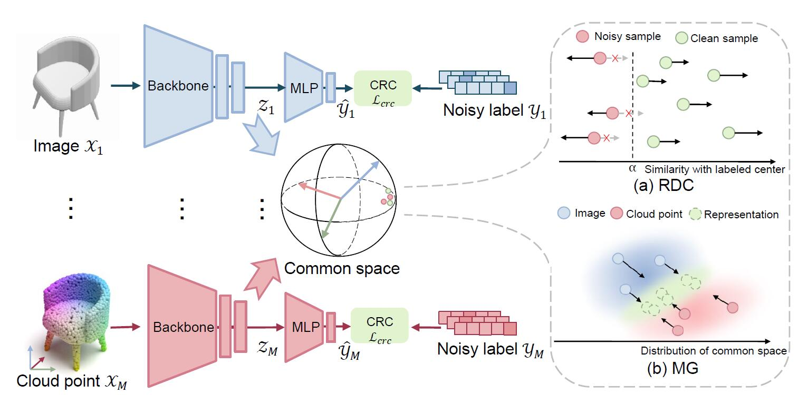

# RONO
Yanglin Feng, Hongyuan Zhu, Dezhong Peng, Xi Peng, Peng Hu, RONO: Robust Discriminative Learning with Noisy Labels for 2D-3D Cross-Modal Retrieval (CVPR 2023, PyTorch Code)

## Abstract
Recently, with the advent of Metaverse and AI Generated Content, cross-modal retrieval becomes popular with a burst of 2D and 3D data. However, this problem is challenging given the heterogeneous structure and semantic discrepancies. Moreover, imperfect annotations are ubiquitous given the ambiguous 2D and 3D content, thus inevitably producing noisy labels to degrade the learning performance. To tackle the problem, this paper proposes a robust 2D-3D retrieval framework (RONO) to robustly learn from noisy multimodal data. Specifically, one novel Robust Discriminative Center Learning mechanism (RDCL) is proposed in RONO to adaptively distinguish clean and noisy samples for respectively providing them with positive and negative optimization directions, thus mitigating the negative impact of noisy labels. Besides, we present a Shared Space Consistency Learning mechanism (SSCL) to capture the intrinsic information inside the noisy data by minimizing the cross-modal and semantic discrepancy between common space and label space simultaneously. Comprehensive mathematical analyses are given to theoretically prove the noise tolerance of the proposed method. Furthermore, we conduct extensive experiments on four 3D-model multimodal datasets to verify the effectiveness of our method by comparing it with 15 state-of-the-art methods.

## Framework
The pipeline of our robust 2D-3D retrieval framework (RONO). First, modality-specific extractors project different modalities $\{ \mathcal{X}_j, \mathcal{Y}_j \}_{j=1}^{M}$ into a common space. Second, our Robust Discriminative Center Learning mechanism (RDCL) is conducted in the common space to divide the clean and noisy data while rectifying the optimization direction of noisy ones, leading to robustness against noisy labels. Finally, RONO employs a Shared Space Consistency Learning mechanism (SSCL) to bridge the intrinsic gaps between common space and label space. To be specific, SSCL narrows the cross-modal gap by a Multimodal Gap loss (MG) while minimizing the semantic discrepancy between the common space and label space using a Common Representations Classification loss (CRC) $\mathcal{L}_{crc}$, thus endowing representations with modality-invariant discrimination.

## Requirements
- python 3.7
- pyTorch 1.7
- torchvision 0.8.2
- numpy 1.20.1
- scikit-learn 0.24.1

## Data
Only 3D MNIST dataset data is currently available (**other codes and data are coming soon**). 

To reduce the computational time and space cost for a quick start, we extracted features using a pre-trained DGCNN backbone for the point cloud data. Feature set: [Dropbox_data](https://www.dropbox.com/sh/efoewi67akk99px/AAAUpM18L1g8tnEWJF1WDclIa?dl=0). Just extract and put the .npy file to ./datasets/3D_MNIST/. e.g. root: './datasets/3D_MNIST/test_img_feat.npy'.

If you use raw data [Kaggle-3D MNIST](https://www.kaggle.com/datasets/daavoo/3d-mnist) , suitable data augmentation can bring the performance of the method to a higher level. 

**For ModelNet**

Due to the limitation of computing resources, we use features extracted by pre-trained models. (The image modality pre-training model has poor feature extraction, so it is discarded)
The point cloud data and noisy labels we use: [ModelNet10](https://www.dropbox.com/scl/fo/x40trsxrjf6opt7l15zsm/h?rlkey=a4z75znlvlbi0odu445ts80e5&dl=0), [ModelNet40](https://www.dropbox.com/scl/fo/2oyahbyp4scnkvb5k96sk/h?rlkey=ujg89pc3sturtbtyozhipgiew&dl=0). You can put them into  ./datasets/ModelNet10/  or  ./datasets/ModelNet40/

 All the 180-view images in ModelNet10/40 could be find in [CrossmodalCenterLoss](https://github.com/LongLong-Jing/Cross-Modal-Center-Loss/issues/2). You can put them into ./datasets/

## Train and test
run open_source_train_mnist.py for training

run evaluate_retrieval_mnist.py for testing

**For ModelNet (you can choose 10/40 in the Argument Settings)**

run open_source_train_modelnet.py for training

run evaluate_retrieval_modelnet.py for testing

## Checkpoints
We have put some completed training models of the 3D MNIST dataset [on dropbox](https://www.dropbox.com/scl/fo/eu5hrfxdskjqthl4hqusz/h?dl=0&rlkey=5j0mrpmydrpf5rog8d91gjdgz), you can put them into under ./checkpoints/3D_MNIST/ and directly modify the path in the evaluate_retrieval_mnist.py for direct use during testing.

**For ModelNet**
We have put some completed training models in [ModelNet10](https://www.dropbox.com/scl/fo/refypdvg4et3lbjcof6yo/h?rlkey=8gybmny17th2gfm2z47yaii73&dl=0) and [ModelNet40](https://www.dropbox.com/scl/fo/5ndmrt29buszwjyiie0zh/h?rlkey=h99p39eenf4o2pmu7xlhbeoys&dl=0) with 40% noise, you can put them into under ./checkpoints/ModelNet10(or 40)/ and directly modify the path in the evaluate_retrieval_modelnet.py for direct use during testing.

## Reproduction of results
(2023.3.12) The results of arbitrarily run experiments have met or even exceeded the results reported by our method. The models to which the experimental results belong are being stored in checkpoints.

Results:

noise: 20%

ength of the dataset:  1000

number of img views:  1

Image2Pt---------------------------

96.16

Pt2Image---------------------------

94.42

-----------------------------------

noise: 40%

length of the dataset:  1000

number of img views:  1

Image2Pt---------------------------

95.22

Pt2Image---------------------------

93.18

-----------------------------------

noise: 60%

length of the dataset:  1000

number of img views:  1

Image2Pt---------------------------

93.25

Pt2Image---------------------------

92.28

-----------------------------------

noise: 80%

length of the dataset:  1000

number of img views:  1

Image2Pt---------------------------

83.24

Pt2Image---------------------------

82.27

**For ModelNet10 __ 40% noise**

number of img views:  1

Image2Image---------------------------

86.18

Image2Point---------------------------

87.1

Point2Point---------------------------

89.37

Point2Image---------------------------

87.06

**For ModelNet40 __ 40% noise**

Image2Image---------------------------

85.02

Image2Point---------------------------

85.82

Point2Point---------------------------

87.53

Point2Image---------------------------

85.47

## Citation
@InProceedings{Feng_2023_CVPR,
    author    = {Feng, Yanglin and Zhu, Hongyuan and Peng, Dezhong and Peng, Xi and Hu, Peng},
    title     = {RONO: Robust Discriminative Learning With Noisy Labels for 2D-3D Cross-Modal Retrieval},
    booktitle = {Proceedings of the IEEE/CVF Conference on Computer Vision and Pattern Recognition (CVPR)},
    month     = {June},
    year      = {2023},
    pages     = {11610-11619}
}